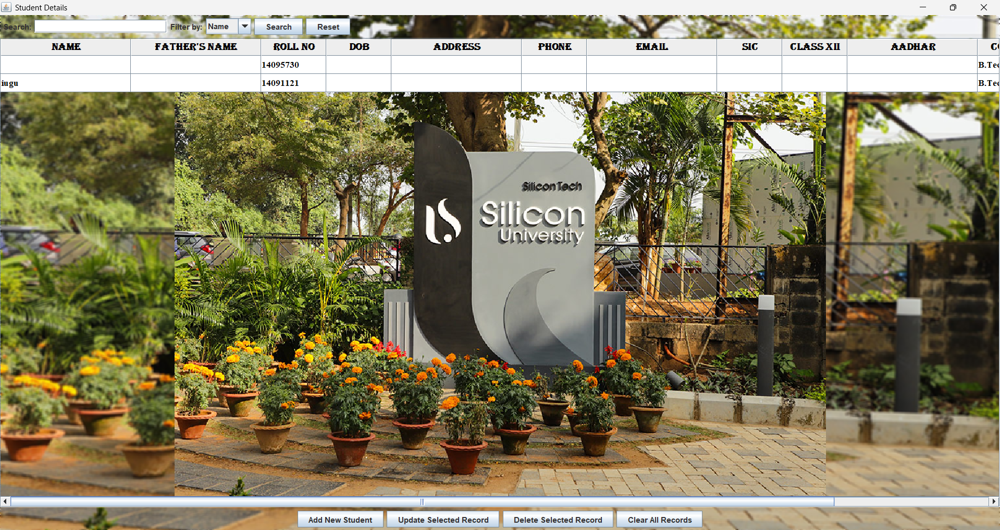
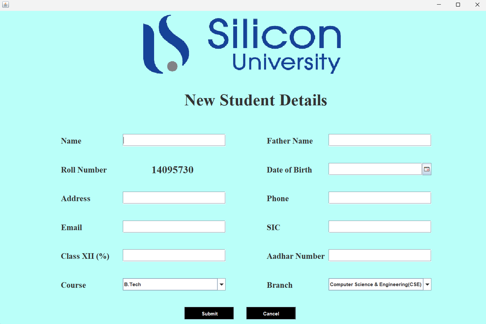
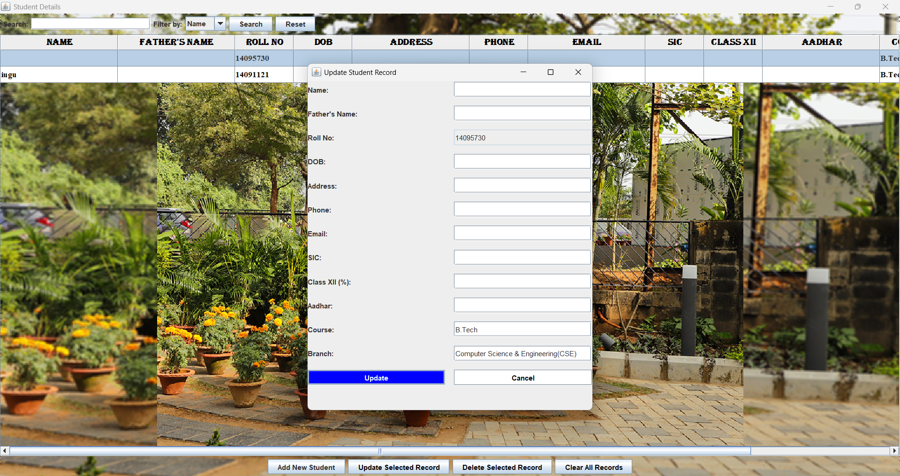

# Student Management System (Java + Swing + Oracle DB)

This is a **Java Swing-based desktop application** for managing student data, built with **Oracle Database** and **JDBC** for persistent storage. It supports full CRUD operations: adding, viewing, updating, deleting, and searching student records with a clean GUI and responsive UI design.

---

## 🔧 Features

- 📄 Add new student records with roll number auto-generation
- 📝 Update existing student records from the display table
- ❌ Delete individual records or clear all entries
- 🔍 Search and filter by name, roll number, course, or branch
- 📊 Display records in a JTable with styling and blurred background
- 📅 Date selection using `JDateChooser`
- 🎨 Hover effects for UI buttons
- 💾 Oracle database backend via JDBC

---

## 📁 Project Structure

```
src/
├── DisplayFrame.java     // Main window to display/search/manage data
├── InsertData1.java      // Form to insert new student records
└── UpdateFrame.java      // Form to update selected student record
```

---

## 💻 Technologies Used

- **Java Swing** (UI)
- **Oracle Database 11g+**
- **JDBC** (Database Connectivity)
- **JDateChooser** for date input
- **Git & GitHub** for version control

---

## 🛠️ How to Run

1. **Setup Oracle Database** and create the table:
```sql
CREATE TABLE student_data1 (
  name VARCHAR2(100),
  fname VARCHAR2(100),
  rollno VARCHAR2(20) PRIMARY KEY,
  dob VARCHAR2(20),
  address VARCHAR2(200),
  phone VARCHAR2(15),
  email VARCHAR2(100),
  sic VARCHAR2(10),
  xii VARCHAR2(10),
  aadhar VARCHAR2(20),
  course VARCHAR2(50),
  department VARCHAR2(100)
);
```

2. **Edit your database credentials** inside Java files:
```java
DriverManager.getConnection("jdbc:oracle:thin:@localhost:1521:xe", "system", "arman0803");
```

3. Compile and run:
```bash
javac src/*.java
java src.DisplayFrame
```

---

## 📷 Screenshots

| DisplayFrame (Main View) | Insert Form | Update Form |
|--------------------------|-------------|-------------|
|  |  |  |


---

## 👨‍💻 Author

**Arman Khan**  
GitHub: [@arman080325](https://github.com/arman080325)

---

## 📄 License

```text
MIT License

Copyright (c) 2024 Arman Khan

Permission is hereby granted, free of charge, to any person obtaining a copy
of this software and associated documentation files (the "Software"), to deal
in the Software without restriction...
